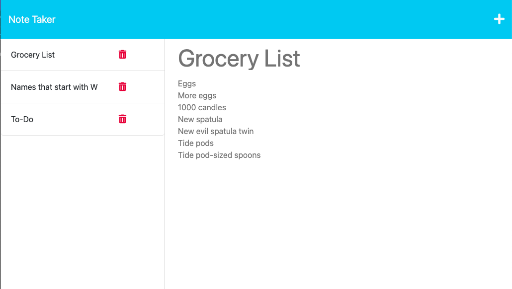

# legendary-broccoli-11

## Description
The Module 11 Challenge demonstrates the use of Express.js to create a note taker which saves and retrieves data from a JSON file

## Table of Contents
- [Usage](#usage)
- [Credits](#credits)
- [License](#license)

## Usage
To use my app, click on this link:
[My Note Taker](https://legendary-broccoli-11-3d57ad0ea705.herokuapp.com/)

My note taker allows you to write, save, and delete notes as needed. 
Simply fill in your title and note content and click the "Save" icon on the left. Your new note should save to the list on the left. You can click on your previous notes to retrieve them, and when they are no longer needed, the trash icon can delete them. 

## Credits
The following websites were used to generate this project:

[Professional README.md Guide](https://coding-boot-camp.github.io/full-stack/github/professional-readme-guide)

[Heroku App Error Troubleshooting](https://stackoverflow.com/questions/14322989/first-heroku-deploy-failed-error-code-h10)

## License
None.